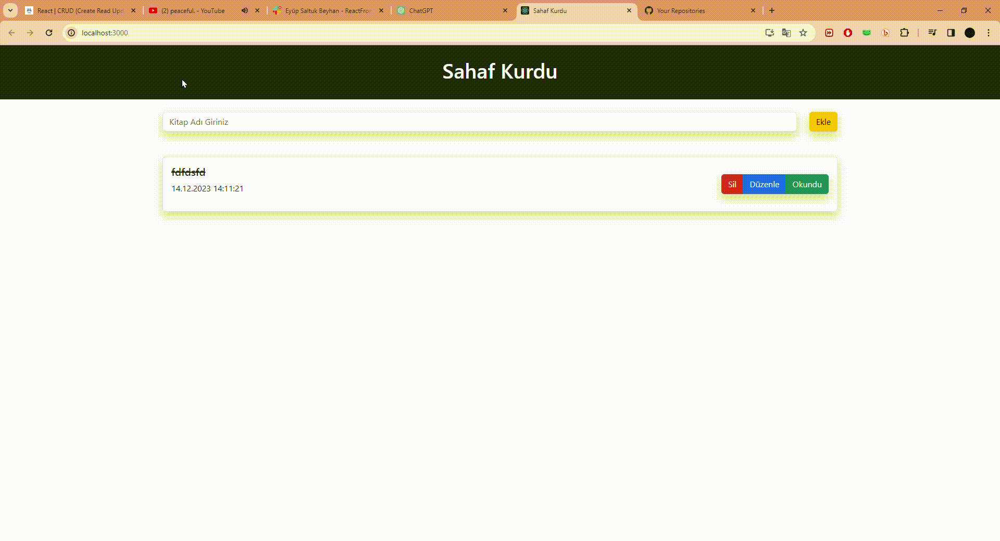

# SahafKurduJS

<h1>Okunan Kitapları ekleme  düzenleme sitesi  </h1>

  * Modal pencerelerimiz components adındaki dosyada bulunmaktadır  
  * Html kodlarımız modal dosyalarında yer almaktadır. 
  * Stil kodlarımız index dosyasında yer almaktadır. 

  * Girilen kitap isimleri düzeltilebilir 
  * Okunan kitap isimleri işaretlenerek üstü çizilebilir. 
  * Okunan kitap silinebilir 

<h2>Kullanilan Teknolojiler</h2>

-REACT 
-CSS   
-HTML  

<h1>Proje Gif</h1>

# SahafKurdu
